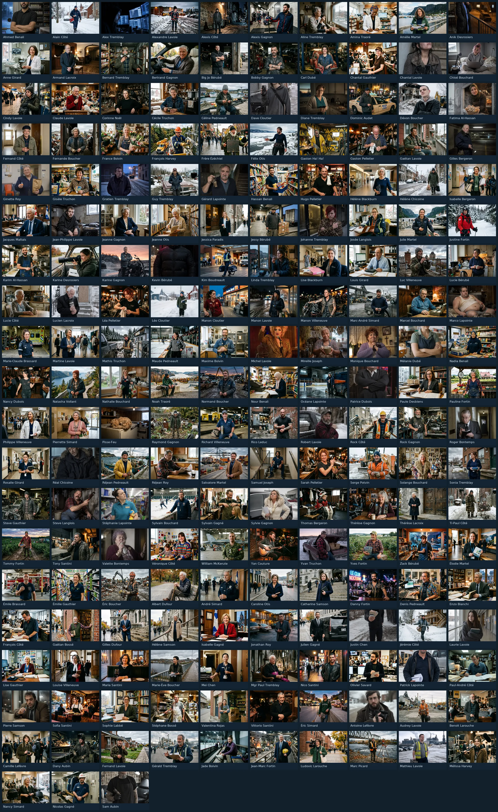

# Base de données de personnages fictifs — La Baie (Saguenay)

Projet personnel de **fiction** : **203 personnages géolocalisés et illustrés**
dans la ville de Saguenay (arrondissements de La Baie, Chicoutimi et
Jonquière, Québec), dont **202 humains et 1 animal**. Les personnages, noms,
situations et numéros civiques sont **entièrement inventés** ; les rues et
les toponymes sont réels (OpenStreetMap).

🗺️ **Carte interactive** : ouvrir [`carte-la-baie-saguenay.html`](carte-la-baie-saguenay.html)
(ou [`carte/index.html`](carte/index.html)).
📇 **Planche contact des 203 portraits** : [`portraits/planche-contact-generale.webp`](portraits/planche-contact-generale.webp).

<a href="portraits/planche-contact-generale.webp"></a>

> ⚠️ **Avertissement** : numéros civiques fictifs (ne pas utiliser comme
> adresses postales), coordonnées à l'échelle du quartier (± 400 m),
> **portraits générés par IA** — aucune personne réelle photographiée.

---

## Contenu du dépôt

| Fichier / dossier | Rôle |
|---|---|
| `data/personnages.csv` | **Source de vérité** : 203 lignes × 16 colonnes, UTF-8 `;`. C'est le seul fichier à éditer à la main. |
| `data/factions.txt` | Vocabulaire contrôlé des **17 factions** (narration). |
| `data/narration.csv` | ⚠️ **Privé, non versionné** : factions, répliques, arcs (voir plus bas). |
| `base_personnages_fictifs.xlsx` | Classeur **public** : *Personnages* (203 × 16) + *Lisez-moi*. **Sans** la narration. |
| `base_personnages_fictifs-complet.xlsx` | Classeur **privé** (`.gitignore`) : idem + feuille *Narration*. |
| `base_personnages_fictifs.csv` | Export tableur, séparateur `;`, UTF-8 BOM (accents OK dans Excel FR). |
| `base_personnages_fictifs.json` | Export code / API, clés minuscules sans accent. |
| `base_personnages_fictifs.geojson` | Points WGS84 pour QGIS, geojson.io, uMap, Mapbox. |
| `carte/index.html` | Carte interactive Leaflet — **source HTML unique** (données réinjectées par le script). |
| `carte-la-baie-saguenay.html` | Copie de racine **dérivée** de `carte/index.html` (ne jamais l'éditer). |
| `carte/vendor/leaflet/` | **Leaflet 1.9.4 en copie locale (BSD-2)** : aucun CDN. |
| `carte/portraits/` | Vignettes 400 px servies par la carte (synchronisées par le script). |
| `portraits/` | Deux gabarits WebP par personnage : `-web.webp` et `-vignette.webp`, plus la planche contact. |
| `construire_base.py` | Générateur **idempotent et reproductible** de tous les livrables. |
| `scripts/init_source_csv.py` | Migration unique : ancien classeur maître → `data/*.csv`. |
| `scripts/retirer_archives_git.sh` | Purge optionnelle de l'ancien gabarit « archive » dans l'historique Git. |
| `scripts/historique/` | Scripts de migration passés, conservés pour mémoire. |
| `tests/test_base.py` | **41 garde-fous** couvrant toutes les conventions, lancés en CI. |
| `.github/workflows/validation.yml` | CI : lint + régénération + contrôle de reproductibilité + tests. |
| `docs/analyse-projet.md` | Revue complète du projet (données, code, licences, carte). |
| `LICENSE` / `LICENSE-DONNEES.md` | Trois statuts distincts : code MIT, données ODbL, portraits IA en CC BY 4.0. |

## Colonnes (16)

`Nom` · `Surnom` · `Type` · `Age` · `Rôle` · `Secteur` · `Adresse` ·
`Latitude` · `Longitude` · `Apparence` · `Vêtements` · `Tic / Objet` ·
`Portrait` · `Famille` · `Branche` · `Parenté` — le dictionnaire détaillé
(dans le classeur, feuille *Lisez-moi*) est généré depuis `construire_base.py`.

Principales conventions :

- **Surnom** : une cellule vide signifie « pas de surnom » (personnage « rangé
  »), ce n'est pas un oubli. Le surnom ne s'écrit **jamais** dans le `Nom`.
- **Rôle** : métier autonome, sans référence à un autre personnage ni à une
  faction / un clan (le clan va dans `Famille` ; la faction, dans la narration).
- **Adresse** : `« Numéro, Rue »` (numéro inventé, rue réelle OSM) ; pour les
  lieux non adressables (plein air, sentier, base militaire) : `Lieu-dit : …`.
- **Vêtements** : `s.o.` = sans objet (ex. un animal), vide = inconnu.
- **Famille + Branche** : la famille est le nom du clan, **sans** qualificatif ;
  la branche précise le foyer (« JP », « ruelle », « motards »…). Deux foyers
  homonymes partagent la `Famille` et se distinguent par la `Branche`.
- **Factions** (narration) : 17 valeurs canoniques listées dans
  `data/factions.txt` ; l'ancienne nuance est gardée dans « Faction (détail) ».
- **Âge** : huit personnages sont mineurs (9 à 17 ans) — la cohorte
  « jeunes » (aréna, école, cégep) a été étoffée le 2026-09-13 ; le seul
  personnage de moins de 18 ans qui ne soit pas humain reste le chat
  Pisse-Feu (7 ans en âge animal).

## Narration : ce qui est public et ce qui ne l'est pas

| | Public (dépôt, exports, carte) | Privé (local, `.gitignore`) |
|---|---|---|
| Personnages (16 colonnes) | ✔ `data/personnages.csv`, xlsx/csv/json/geojson, carte | |
| Factions, répliques, arcs | ✘ jamais | ✔ `data/narration.csv`, `base_personnages_fictifs-complet.xlsx` |
| Vocabulaire des factions | ✔ `data/factions.txt` | |

La narration n'est exportée ni dans le JSON, ni dans le GeoJSON, ni dans la
carte — et le classeur commité ne la contient pas. Un test et une étape CI
échouent si `data/narration.csv` venait à être ajouté à l'index Git.

## Démarrage rapide

```bash
# 1. (optionnel) environnement isolé
python3 -m venv .venv && . .venv/bin/activate
pip install -r requirements.txt
pip install -r requirements-dev.txt        # ruff (qualité de code)

# 2. ouvrir la carte (double-clic, ou)
python3 -m http.server 8000
#   → http://localhost:8000/carte-la-baie-saguenay.html

# 3. modifier la base : éditer data/personnages.csv, puis
python3 construire_base.py
#    régénère les deux classeurs, csv / json / geojson, réinjecte les données
#    dans carte/index.html, en dérive carte-la-baie-saguenay.html,
#    synchronise les vignettes et reconstruit la planche contact.

# 4. contrôler la base
python3 -m unittest discover -s tests -v   # 41 garde-fous
ruff check .                               # lint
```

La source se modifie dans un tableur comme n'importe quel CSV (`;` et UTF-8) ;
à défaut, un éditeur de texte suffit, et le diff Git reste lisible ligne à ligne.

### Utilisation hors ligne

Le **code** de la carte est vendorié (`carte/vendor/leaflet/`) : aucun accès à
un CDN n'est nécessaire et la carte s'ouvre sans réseau. Seuls les **fonds de
tuiles** et la recherche de lieux (Nominatim) restent des services en ligne
(voir les licences dans [`LICENSE-DONNEES.md`](LICENSE-DONNEES.md), § 4) ; pour
un usage 100 % hors ligne, brancher des tuiles locales (MBTiles / PMTiles).
La **recherche de personnages**, elle, est locale et fonctionne sans réseau.

## Reproductibilité et qualité

- `construire_base.py` n'écrit **aucune donnée volatile** : la date « Généré
  le » est figée (surcharge possible via `SOURCE_DATE_EPOCH`) et les
  métadonnées du classeur sont normalisées — un zip réécrit à date fixe
  (`figer_xlsx`). Relancer le script deux fois produit des fichiers **octet
  pour octet identiques**, ce que la CI vérifie en comparant deux
  constructions successives puis en exigeant un `git diff` vide. Seule la
  **planche contact WebP** dépend du codec `libwebp` natif : son idempotence
  est garantie sur un même runner, sans comparaison binaire
  inter-environnements (la fonte, elle, est vendoriée dans `assets/fonts/`).
- Les **41 garde-fous** vérifient notamment : effectifs et cohérence des 4
  exports, conformité de la source texte, **unicité et absence de `];`** dans
  les valeurs, adresses avec numéro ou `Lieu-dit :`, rôles sans clan,
  **Famille/Branche sans parenthèses**, coordonnées dans le bon arrondissement,
  mineurs présents, **narration absente du classeur public et de l'index Git**,
  factions dans le vocabulaire contrôlé, portraits et planche contact présents,
  Leaflet sans CDN, **carte de racine strictement dérivée de la canonique**,
  échappement HTML, et les trois licences distinguées. Le nombre annoncé dans
  ce README est lui-même vérifié par un test (il annonçait 26 tests).
- La CI tourne à chaque push/PR **et une fois par semaine** (détection des
  dépendances cassées), avec un job de lint `ruff` (aucune règle cosmétique,
  et aucun crochet pre-commit qui toucherait aux livrables générés).

## Provenance et licences

- **Rues et géocodage** : © contributeurs OpenStreetMap via Overpass et
  Nominatim, **ODbL**.
- **Portraits** : images **générées par IA**, personnages fictifs, **CC BY 4.0**.
- **Code** : **MIT** ; carte basée sur **Leaflet 1.9.4 (BSD-2)**.

Le détail des obligations (paternité, share-alike, étiquetage IA, conditions
des tuiles) est dans **[`LICENSE-DONNEES.md`](LICENSE-DONNEES.md)**.
